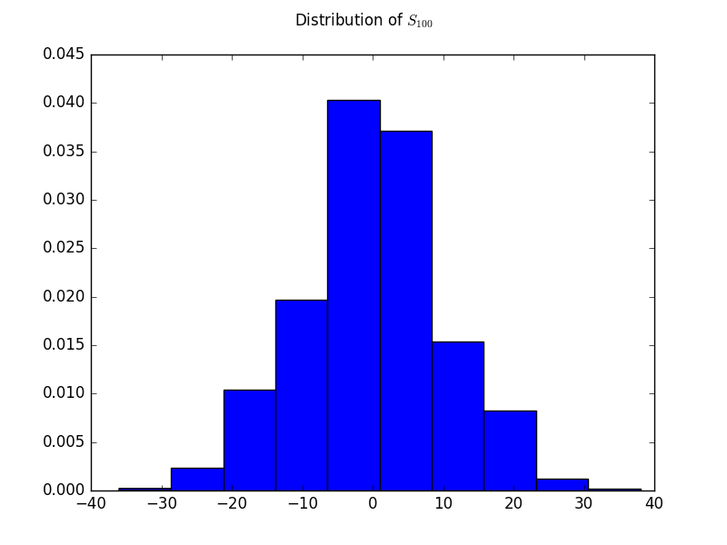
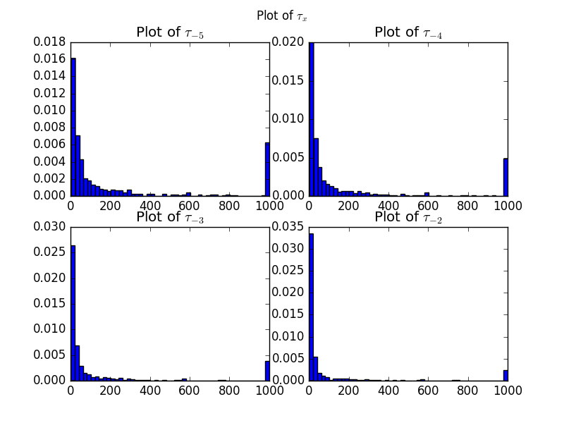
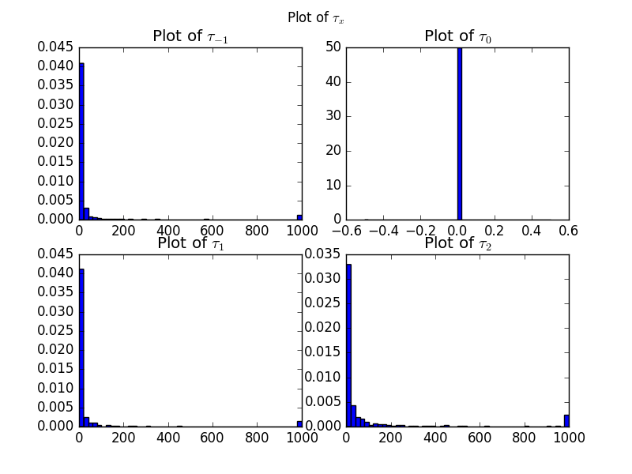
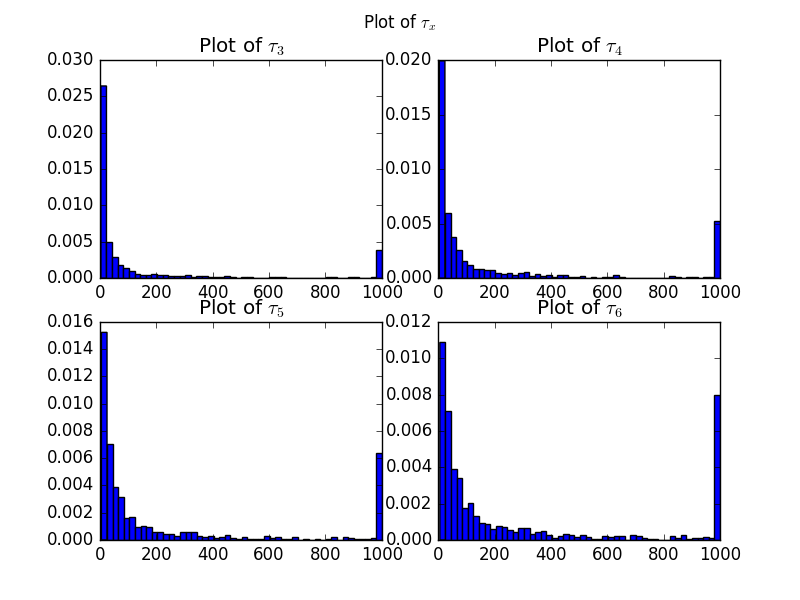
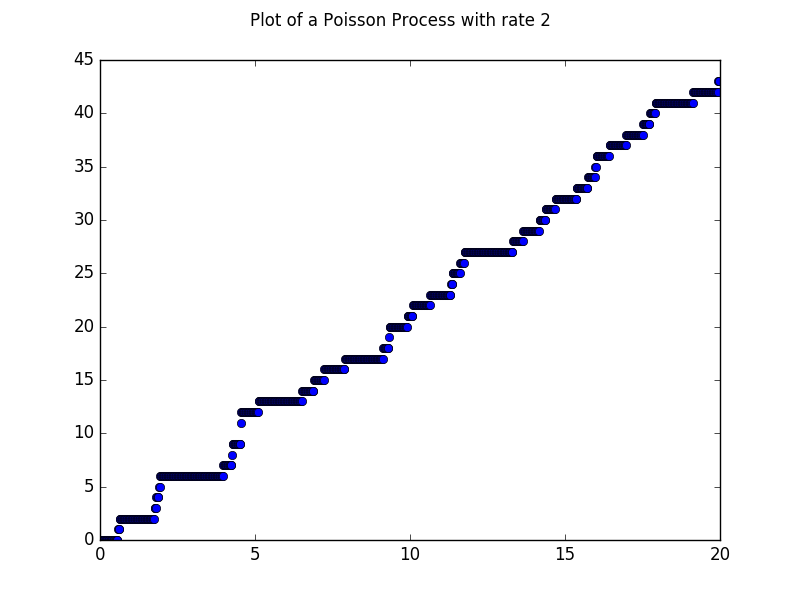

```{r setup, include=FALSE}
knitr::opts_chunk$set(echo = TRUE)
```

# Distribution of $S_{100}$
## Expectation
We know that $S_{100}$ is the sum of 100 i.i.d. $\{-1, 1\}$-valued Bernolli random variables, i.e.
\(S_{100} = \sum^{100}_{i=1} \xi_i\)

Thus, \(\mathbb{E}(\xi_1 + \xi_2 + ... + \xi_100) = \mathbb{E}(\xi_1) + \mathbb{E}(\xi_2) + ... + \mathbb{E}(\xi_100) = 100 \cdot \mathbb{E}(\xi_1)\)

By conditioning,
\(100 \cdot \mathbb{E}(\xi_1) = 100 \cdot ((1/2 \cdot 1) + (1/2 \cdot -1)) = 100 \cdot 0 = 0 \)

## Variance
Since the variance of one Bernolli random variable is $p(1-p)$ = $0.5^2$, the variance of 100 
of them should be $100 * 0.5^2 = 25$.

## Distribution
Since we're taking 10000 samples, by the Central Limit Theorem $S_{100}$ should be Normally distributed according to the mean and variance described above.

\pagebreak

## Graph
Our calculations  can be confirmed in the graph below.

\

\pagebreak

# Distribution of the Minimum Hitting Time
Since the expectation of the minimum hitting time for some $x \in \mathbb(Z)$ is infinite, I've decided to stop the random walk at 1000 steps.

\
\
\

\pagebreak

# Graph of a Poisson Process with Rate 2
\


# Expected Value of $N(10)$
Theoreticaly, \(\mathbb{E}(N(10)) = 10 \cdot \lambda = 10 \cdot 2 = 20\).
My Python calculation is very close to this amount.